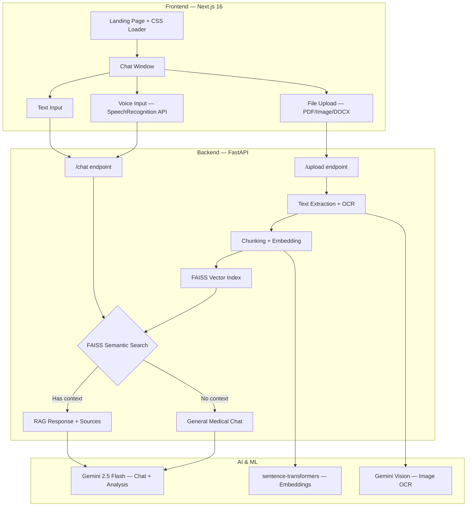

<div align="center">

# 🩺 Curely AI — Medical RAG Chatbot

### AI-Powered Medical Assistant with Document Understanding

[](https://fastapi.tiangolo.com)
[](https://nextjs.org)
[](https://ai.google.dev)
[](https://github.com/facebookresearch/faiss)
[](https://python.org)
[](https://openai.com)
[](https://github.com/adnanjitu15/curely-ai/actions)
[](https://docker.com)

**Curely AI** is a production-grade medical chatbot that uses **Retrieval-Augmented Generation (RAG)** to analyze medical reports, lab results, and health documents with clinical precision. Upload a blood report image, and get an instant, structured analysis with actionable health advice — complete with source attribution.

</div>

---

## ✨ Features

| Feature | Description |
|---------|-------------|
| 🧠 **RAG Pipeline** | Upload documents → OCR extraction → FAISS vector embeddings → semantic search → context-injected AI responses |
| 📄 **Multi-Format Upload** | PDFs, images (JPG/PNG), and Word documents (DOCX) with automatic text extraction |
| 🔬 **Medical Report Analysis** | Parses lab values (HbA1C, cholesterol, etc.) with ✅/⚠️/🚨 status indicators and actionable advice |
| 🎤 **Voice Input** | Google-style voice overlay using SpeechRecognition API with auto-transcription |
| 📝 **Markdown Rendering** | AI responses rendered with rich formatting (headers, tables, bold, lists) |
| 📌 **Source Attribution** | Shows which document chunks informed the AI's response with relevance scores |
| 🎨 **Premium UI** | Animated landing page, CSS loader, Framer Motion transitions, toast notifications |
| ✏️ **Chat Actions** | Copy, edit, and delete messages with hover-reveal action buttons |
| 🔄 **Multi-LLM Toggle** | Switch between ✨ Gemini 2.5 Flash and 🧠 GPT-4o with graceful fallback |
| 💾 **Chat History** | SQLite-backed session persistence with full CRUD via SQLAlchemy ORM |
| 🐳 **Docker Ready** | Full Dockerfile + docker-compose for one-command deployment |
| ⚙️ **CI/CD Pipeline** | Automated testing (Pytest) and linting (Flake8) via GitHub Actions |

---

## 🏗️ Architecture



---

## 🛠️ Tech Stack

| Layer | Technology | Purpose |
|-------|-----------|---------|
| **Frontend** | Next.js 16, React, TypeScript | Server-side rendered UI |
| **Animations** | Framer Motion | Page transitions, micro-interactions |
| **Styling** | Tailwind CSS v4 | Utility-first responsive design |
| **Markdown** | react-markdown + remark-gfm | Rich AI response rendering |
| **Backend** | FastAPI, Uvicorn, Pydantic | Async REST API with validation |
| **LLM** | Google Gemini 2.5 Flash | Medical chat + report analysis |
| **OCR** | Gemini Vision API + pytesseract | Dual-strategy text extraction from images |
| **Embeddings** | sentence-transformers (all-MiniLM-L6-v2) | 384-dim text embeddings |
| **Vector DB** | FAISS (Facebook AI Similarity Search) | Cosine similarity search over document chunks |
| **Document Processing** | PyPDF, PyMuPDF, python-docx, Pillow | Multi-format document support |

---

## 📁 Project Structure

```
medical-rag/
├── app/                          # Backend (FastAPI)
│   ├── main.py                   # API endpoints (/chat, /upload, /sessions, /health)
│   ├── core/
│   │   └── schemas.py            # Pydantic models (ChatRequest, ChatResponse, SourceChunk)
│   ├── db/
│   │   ├── database.py           # SQLAlchemy engine + session factory
│   │   └── models.py             # ORM models (ChatSession, ChatMessage)
│   ├── services/
│   │   ├── chat_service.py       # Multi-LLM integration (Gemini + OpenAI) + system prompts
│   │   ├── pdf_service.py        # PDF/Image/DOCX text extraction + OCR pipeline
│   │   └── vector_store.py       # FAISS vector index + semantic search
│   └── tests/
│       └── test_backend.py       # 35+ unit tests (schemas, services, API, DB)
├── medical-frontend/             # Frontend (Next.js 16)
│   ├── app/
│   │   ├── page.tsx              # Main application (chat, voice, uploads)
│   │   ├── layout.tsx            # Root layout with metadata
│   │   ├── globals.css           # Tailwind config + CSS loader animations
│   │   └── components/
│   │       ├── Navbar.tsx         # Navigation bar
│   │       └── MewowBot.tsx      # Bot avatar component
│   ├── Dockerfile                # Frontend container
│   └── package.json
├── .github/workflows/ci.yml     # GitHub Actions CI (Pytest + Flake8)
├── Dockerfile                    # Backend container (Python 3.11-slim)
├── docker-compose.yml            # Multi-service orchestration
├── requirements.txt              # Python dependencies
├── .env.example                  # Environment variable template
└── README.md                     # This file
```

---

## 🚀 Quick Start

### Prerequisites
- Python 3.11+
- Node.js 18+
- [Gemini API Key](https://aistudio.google.com/apikey)

### 1. Clone & Setup Backend
```bash
git clone https://github.com/adnanjitu15/curely-ai.git
cd curely-ai

# Create virtual environment
python -m venv venv
source venv/bin/activate  # Windows: .\venv\Scripts\activate

# Install dependencies
pip install -r requirements.txt

# Configure environment
cp .env.example .env
# Edit .env and add your GEMINI_API_KEY
```

### 2. Start Backend
```bash
uvicorn app.main:app --reload
# API running at http://localhost:8000
# API docs at http://localhost:8000/docs
```

### 3. Start Frontend
```bash
cd medical-frontend
npm install
npm run dev
# Frontend running at http://localhost:3000
```

---

## 🔬 How the RAG Pipeline Works

1. **Upload** — User uploads a medical report (PDF/image/DOCX)
2. **Extract** — `pdf_service.py` extracts text via PyPDF or Gemini Vision OCR
3. **Chunk** — Text is split into ~700-character semantic chunks
4. **Embed** — Each chunk is converted to a 384-dim vector using `all-MiniLM-L6-v2`
5. **Index** — Vectors are L2-normalized and added to a FAISS `IndexFlatIP` index
6. **Query** — User asks a question → query is embedded → FAISS finds top-k similar chunks
7. **Augment** — Relevant chunks are injected into the Gemini prompt as `[Document Context]`
8. **Generate** — Gemini 2.5 Flash generates a context-aware, clinically precise response
9. **Attribute** — Source chunks with relevance scores are shown below the response

---

## 📡 API Documentation

### `POST /chat`
Send a message and get an AI response with optional source attribution.

```json
// Request
{ "message": "What does my HbA1C level mean?", "provider": "gemini", "session_id": "abc-123" }

// Response
{
  "reply": "Your HbA1C of 9.6% indicates uncontrolled diabetes...",
  "sources": [
    { "text": "HbA1C: 9.6% Normal: <5.7...", "score": 0.8742 }
  ],
  "session_id": "abc-123"
}
```

### `POST /upload`
Upload a document for RAG processing.

```json
// Response
{
  "filename": "blood_report.jpg",
  "characters_extracted": 1247,
  "chunks_created": 4,
  "preview": "IBN SINA DIAGNOSTIC CENTER..."
}
```

### `POST /sessions` | `GET /sessions` | `GET /sessions/{id}` | `DELETE /sessions/{id}`
Full CRUD for chat session management with message history persistence.

### `GET /health`
Health check endpoint.

---

## ✅ Completed Milestones

- [x] Chat history persistence with SQLite (SQLAlchemy ORM)
- [x] Docker containerization (Dockerfile + docker-compose.yml)
- [x] OpenAI GPT-4o as switchable LLM provider with graceful fallback
- [x] CI/CD pipeline with GitHub Actions (Pytest + Flake8)
- [x] Voice input via Web SpeechRecognition API
- [x] Source attribution with relevance scores
- [x] Multi-format document upload (PDF, Image, DOCX)
- [x] Privacy-scoped sessions via localStorage

## 🔮 Future Improvements

- [ ] LangChain integration for advanced RAG chains
- [ ] User authentication with Google OAuth
- [ ] Pinecone cloud vector DB for persistent, scalable search
- [ ] Dark mode toggle
- [ ] Deployment to cloud (Render / AWS / Azure)

---

## 📄 License

This project is built for educational and portfolio purposes.

---

<div align="center">
  <b>Built with ❤️ by Adnan — AI Engineering Portfolio Project</b>
</div>
